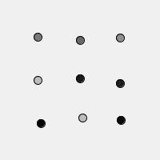

# processing-random-class

If you want moving circles in a grid, moving in place (so eg. random(-5,5)), you can't use randomSeed anymore, because they would not move anymore.
But for the (random) gray color of each circle you dó need randomSeed, because each draw loop they need to be the same (random) color.

This is solved by creating a class for the random function. Each object receives its own randomSeed (or not).

This example is based on the class code in [this discussion](https://discourse.processing.org/t/cross-language-random-numbers/3474) from author [Jeremy Douglass](https://github.com/jeremydouglass). 

### Result:

